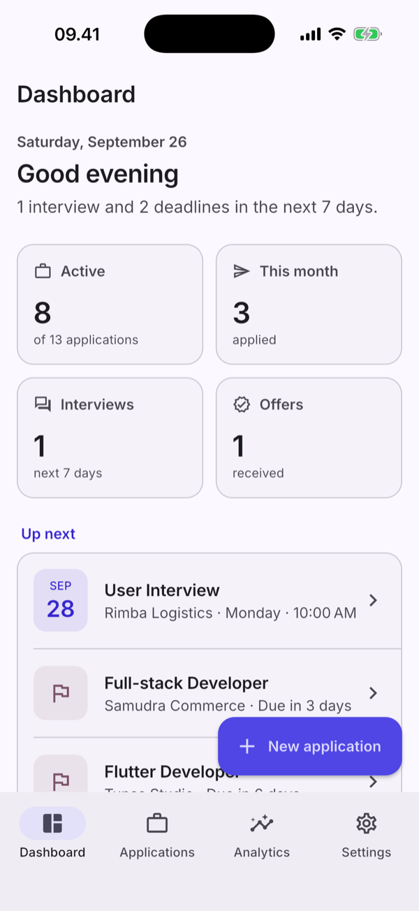
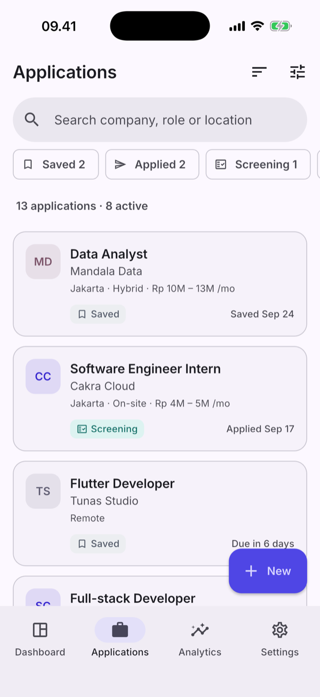
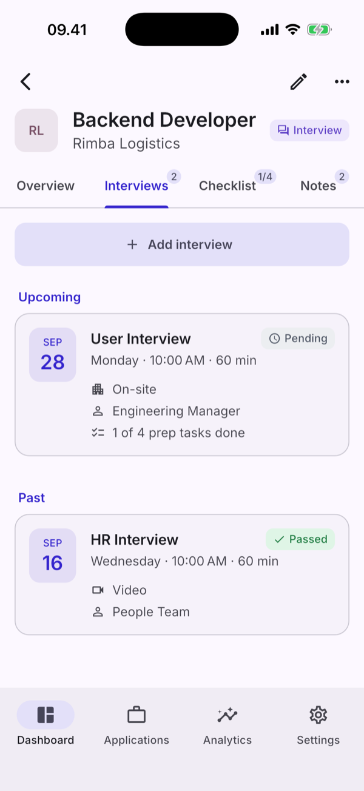
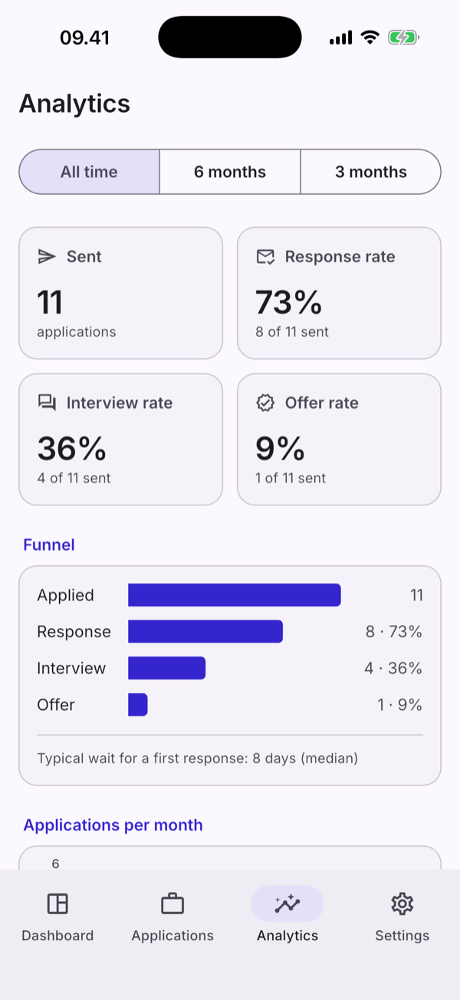
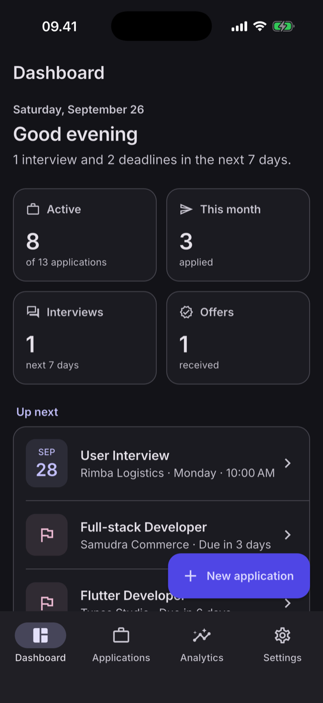
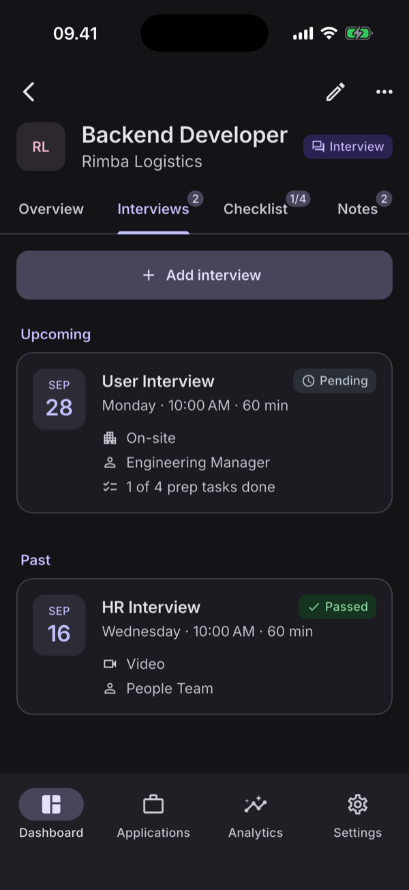
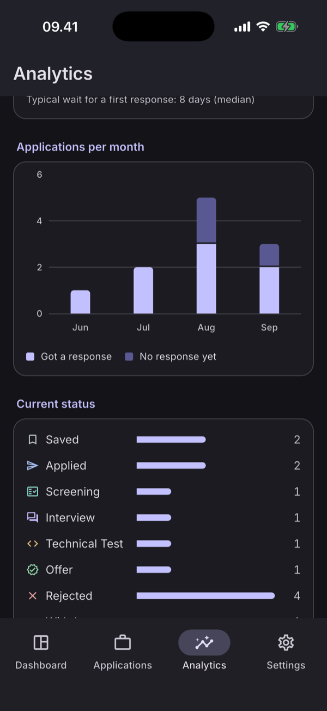

# Job Tracker

A personal, local-first mobile app for running a job search: every application,
its status history, interviews, preparation checklist and notes — plus a
dashboard for what's next and analytics that are actually computed from your data.

Built with Flutter for **iOS and Android** (phones and tablets). No account, no
backend, no tracking: data lives in SQLite on the device, with JSON backups you
control.

<p>
  
  
  
  
</p>
<p>
  
  
  
</p>

## Features

- **Applications** — company, role, location, work mode, employment type, salary
  range, job link, applied date, deadline and status (Saved → Applied → Screening →
  Interview → Technical Test → Offer, or Rejected / Withdrawn).
- **Status history** — every change is recorded, shown as a timeline and used for
  analytics.
- **Search, filter and sort** — full-text search over company/role/location, status
  chips with counts, a filter sheet (status, work mode, employment type) and four
  sort orders, all executed in SQL.
- **Interviews** — rounds with format, time, meeting link, interviewer, outcome and
  summary; upcoming vs. past; one tap to move the application to *Interview*.
- **Preparation checklist** — quick add, suggestions, drag to reorder, link tasks to
  a specific interview and see prep progress on its card.
- **Notes** — free-form notes per application.
- **Dashboard** — what's next: upcoming interviews and deadlines, key numbers, the
  pipeline and recent activity.
- **Analytics** — response, interview and offer rates (always with raw counts),
  funnel, median time to first response, applications per month and a monthly table,
  for all time / 6 months / 3 months.
- **Settings** — light/dark/system theme (persisted), JSON backup & restore, CSV export
  for spreadsheets, and a guarded "delete all data".
- **Adaptive layout** — bottom navigation on phones, navigation rail on tablets and
  landscape; readable content width; works at 200% text size.

### How the metrics are defined

| Metric | Definition |
|---|---|
| Submitted | Applications with an applied date (in the period) |
| Response rate | Submitted that ever reached Screening or later, **or** were rejected |
| Interview rate | Submitted that ever reached Interview / Technical Test / Offer, or have an interview |
| Offer rate | Submitted that ever reached Offer |

"Ever reached" uses the status history, so an application that was interviewed and
later rejected still counts as interviewed. Withdrawn is not a response.

## Tech stack

| | |
|---|---|
| UI | Flutter 3.47, Material 3, custom design tokens, Inter |
| State / DI | Riverpod 3 (no code generation) |
| Navigation | go_router (`StatefulShellRoute` with a tab per branch) |
| Database | SQLite via Drift (type-safe queries, reactive streams, migrations) |
| Charts | fl_chart, plus plain-widget bars |
| Other | intl, url_launcher, shared_preferences, share_plus, file_picker |

## Architecture

```
UI (lib/features/*)  ──watch/read──▶  Riverpod providers & controllers
                                             │
                          ┌──────────────────┴─────────────────┐
                          ▼                                    ▼
                  Repositories (lib/data)          Services (lib/domain/services)
                          │                        pure Dart: analytics, dashboard
                          ▼
                  Drift / SQLite (lib/data/database)
```

- The UI never talks to the database. Reads are `StreamProvider`s over repository
  streams, so every screen updates by itself after a change; writes go through
  small `AsyncNotifier` controllers.
- Repositories own the invariants: a status change and its history row are written
  in one transaction, the applied date is filled in when an application leaves
  *Saved*, text is normalised, timestamps are UTC and dates are date-only.
- Analytics and dashboard numbers are pure functions over plain data, which keeps
  the metric rules easy to test.

```
lib/
├── core/        router, theme & design tokens, utils
├── data/        database, repositories, backup, settings, file exchange, demo seed
├── domain/      models, enums, errors, pure services
├── providers/   app-wide providers
├── features/    dashboard, applications (+ detail tabs), interviews, analytics, settings
└── shared/      reusable widgets
```

[`CLAUDE.md`](CLAUDE.md) documents the conventions in detail (database, state,
UI, testing and chart rules).

## Getting started

Requirements: Flutter 3.47 (Dart 3.13), Xcode for iOS, Android SDK for Android.

```bash
flutter pub get
flutter run
```

Debug builds show a **Load demo data** button on the empty screen: it fills the app
with 13 fictional applications spread over the last few months.

Useful commands:

```bash
flutter analyze
flutter test                                   # unit, repository and widget tests
flutter test integration_test -d <device>      # real SQLite on a simulator/emulator
dart run build_runner build                    # after changing Drift tables
```

Release signing is described in [`docs/release.md`](docs/release.md).

## Quality

- **~190 automated tests**: domain rules and metric definitions, repositories
  against an in-memory database (including an exact backup → restore round trip),
  and widget tests for every main flow.
- **Accessibility audit** in the test suite: tap-target size, labelled controls and
  text contrast on every main screen in light and dark mode, plus layout at 200%
  text size.
- Chart colors checked with a palette validator (contrast and colour-vision
  separation) in both themes.
- CI on GitHub Actions: formatting, generated code up to date, analyzer, tests.

## Data & privacy

Everything stays on the device. **Settings → Export backup** writes a versioned JSON
file (readable dates, UTC timestamps) that can be restored on any device; restore
replaces all data in a single transaction and rejects damaged files without changing
anything.

## License & credits

Inter is licensed under the SIL Open Font License (`assets/fonts/OFL.txt`).
Company names in the demo data are fictional.
